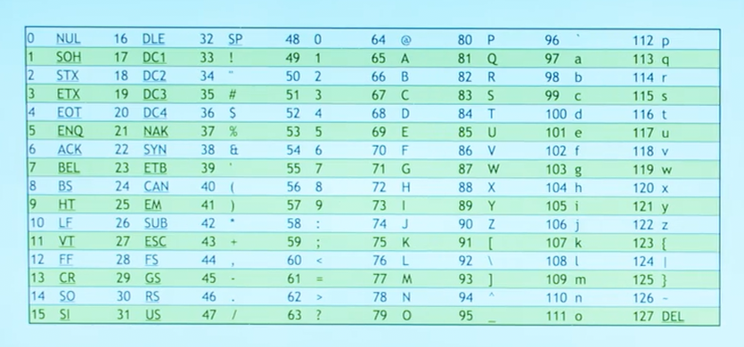

# Hardware

we use computers almost everyday, so what is going on inside our computers? well inside of our computer all these zeros and ones, I mean the computer only understand what we call "binary" system.

if we take "123".. there is what we have learned in lower class which is 1's, 10's, 100's and so on.. so in this case.. 3 is 1's, and 2 is 10's and 1 is 100's.. so that we count not one, two, three.. but one hundred twenty three.

```
100         10          1
__          ___        ___
1           2           3
```
which is:
`100*1 + 10*2 + 1*3`
that ofc gives us `100+20+3` which is equal to 123.

this is the normal counting way.. but computers only understand 0 and 1? they can't count 3,2 or higher numbers the some way we humans count.

## Binary

consider this to be inside of our computer:
```
0   0   0
```
what number might this be? ofc this actuly represent 0.. in computer world... we don't count just like we did above..
```
4   2   1
_________
0   0   0
```

the first 0 is one's place.. what about the middle or the second one?? is that 10's?? no!! it is 2's.. so that we count 2.. then what about the third place? is that 100's? no again.. it is 4's.

there is still a pattern. before we learn that 1, 10's, 100's.. but now,  we learn that in bainary the patter is: 1, 2, 4, 8, 16, 32, 64... in our human world we tend to use "powers of 10." 10 to 0 is one, 10 to 1 is 10, 10 to 2 is 100.

here in computer world.. this is this is 2 to 0 which is 1, 2 to 1 which is 2, 2 to 2, which is 2 squre mean 4.. all we do is changing the base.
```
4   2   1
_________
0   0   0
_________
4*0+2*0+1*0
0   0   0
    0
```

what if we have: 001?
```
4   2   1
0   0   1
__________
4*0+2*0+1*1
0+0+1
= 1
```
what about 2?
```
4   2   1
0   1   0
= 2
```

what about 3?
```
4   2   1
0  1   1
= 3
```
what about 4?
```
4   2   1
1   0   0
= 4
```

what about 7?
```
4   2   1
1   1   1
= 4+2+1
= 7
```

## ASCI
well, how then we represent letters? ofc there is an asci chart... where letters represtend by numbers.. for example 72 is capital "H" and 73 is capital "I" so 72 and 73 is "HI".. but lets do it in binary


```
this looks like two patters on 8.. if you count 8 bit.. it is called byte.. so byte is just 8 bit

so lets take the first byte:
128's  64's    32's    16's    8's  4's    2's    1's
0       1       0       0      1     0      0      0

so to do the arthmethic
64 + 8 = 72

Now lets do the second pattern which is the 73
128's  64's    32's    16's    8's  4's    2's    1's
0       1       0       0      1     0      0      1
64 + 8 + 1 = 73
_________   ________
01001000    01001001
    72          73
    H           I
= HI
```

so to understand well enough we need to look at CPU (the brain), chips, Memory(RAM), HardDisk...